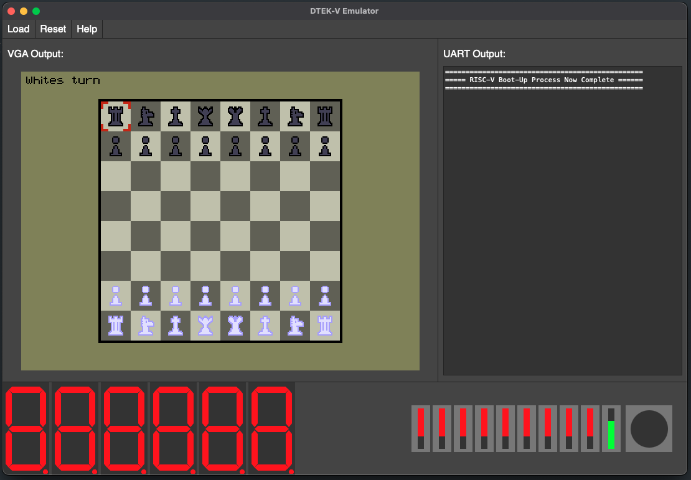

    <h1>DTEK-V emulator</h1>
    
An emulator for the DTEK-V chip, built on top of Web-view

 

## Example:

> [!TIP]
> Run `cargo run --release --examples board_games` to see the emulator in action

Run `dtekv_emulator path/to/bin.bin`, or if you're running directly from this folder: `cargo run --release "path/to/bin.bin"`

> [!NOTE]
> It's recommended to run this emulator in release mode since the debug build is noticeably slower

This project can take the binary you upload to the dtek-v board and run it in an emulated environment, making it easier to develop your programs without having to upload to the chip every time you want to debug.

## Supported IO devices:

- Button
- Switch
- Timer
- VGA output
- Hex displays
- Button interrupts
- Switch interrupts
- Timer interrupts

## Supported Instructions

[See the core module](https://github.com/PumpedSardines/dtekv-emulator-core)
